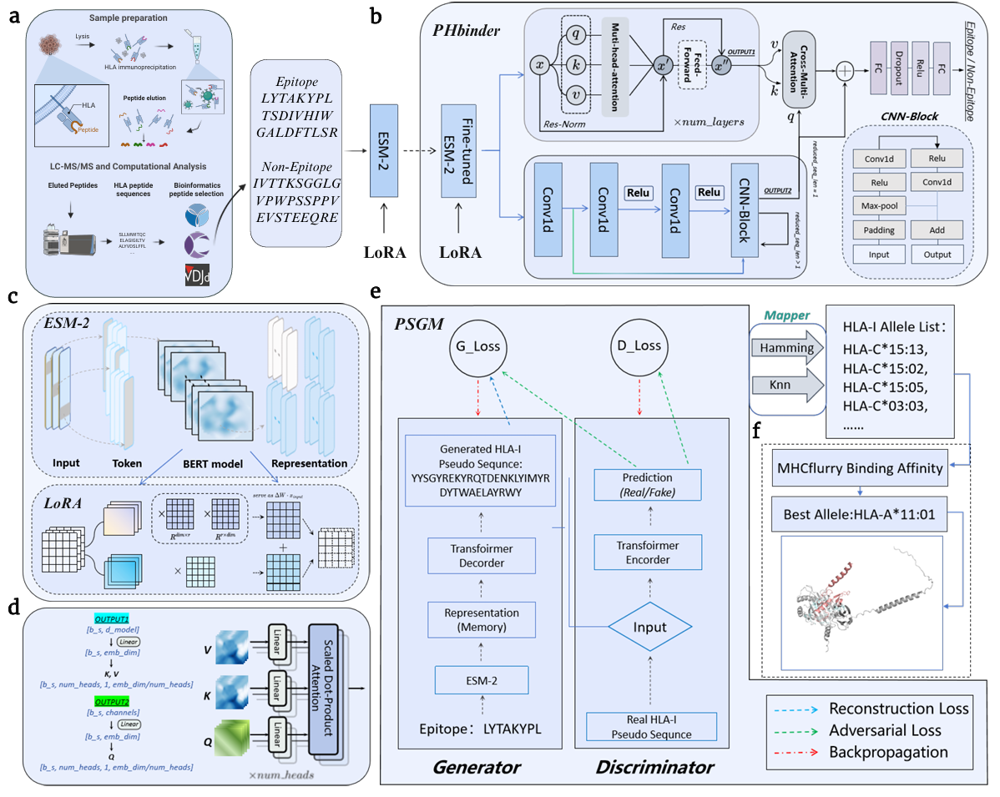

# PHbinder & PSGM: Peptide-HLA Interaction Framework

这是一个用于肽段-HLA结合预测 (PHbinder) 和 HLA 伪序列生成 (PSGM) 的级联框架。PHbinder 模型旨在预测肽段与其结合的 MHC 分子（HLA）之间的结合亲和力，而 PSGM 模型则能根据给定的肽段生成候选的 HLA 伪序列。

## 目录

- [PHbinder & PSGM: Peptide-HLA Interaction Framework](#phbinder--psgm-peptide-hla-interaction-framework)
  - [目录](#目录)
  - [Overview](#overview)
  - [项目结构](#项目结构)
  - [开始复现](#开始复现)
    - [1. 克隆仓库](#1-克隆仓库)
    - [2. 设置 Python 环境](#2-设置-python-环境)
    - [3. 下载预训练模型权重 (ESM-2)](#3-下载预训练模型权重-esm-2)
    - [4. 准备数据集](#4-准备数据集)
    - [5. 配置参数](#5-配置参数)
  - [模型训练与应用](#模型训练与应用)
    - [1. PSGM 模型训练与生成 (HLA 伪序列生成器)](#1-psgm-模型训练与生成-hla-伪序列生成器)
      - [训练 PSGM 模型](#训练-psgm-模型)
      - [生成 HLA 伪序列](#生成-hla-伪序列)
    - [2. PHbinder 模型使用场景](#2-phbinder-模型使用场景)
      - [场景 1: 在自己的数据集上全新训练并测试 PHbinder](#场景-1-在自己的数据集上全新训练并测试-phbinder)
      - [场景 2: 利用已保存的模型参数进行预测/测试](#场景-2-利用已保存的模型参数进行预测测试)
    - [3. 运行级联框架 (端到端工作流)](#3-运行级联框架-端到端工作流)
  - [清理 (可选)](#清理-可选)
  - [常见问题与故障排除](#常见问题与故障排除)
  - [许可证](#许可证)
  - [致谢](#致谢)

---

## Overview

本项目提供了一个端到端的框架，用于处理肽段-HLA结合预测问题。该框架包含两个核心组件：

1.  **PSGM (Pseudo-Sequence Generation Model):** 一个用于根据给定的肽段生成其潜在结合的HLA伪序列的模型。这有助于拓展和丰富HLA结合的上下文信息。
2.  **PHbinder (Peptide-HLA Binding predictor):** 一个利用LoRA微调的ESM-2模型作为特征提取器，并结合交叉注意力机制和分类器，预测肽段-HLA结合亲和力的模型。

```



---

## 项目结构

````

YourProjectName/
├── README.md                           # 本文件
├── LICENSE                             # 项目许可证
├── requirements.txt                    # Python 依赖列表
├── .gitignore                          # Git 忽略文件配置
├── config/
│   ├── phbinder\_config.py              # PHbinder模型训练和推理的配置参数
│   └── psgm\_config.py                  # PSGM模型训练和推理的配置参数
├── data/
│   ├── raw/                            # 原始数据文件
│   │   ├── HLA\_I\_epitope\_train\_shuffle.csv  # PHbinder 训练集
│   │   ├── HLA\_I\_epitope\_validation.csv     # PHbinder 验证集
│   │   ├── HLA\_I\_epitope\_test.csv           # PHbinder 测试集
│   │   ├── hebing.CSV                       # PSGM 训练数据
│   │   └── 伪序列数据.CSV                   # HLA伪序列数据库
│   └── processed/                      # 预处理或中间生成的数据 (由脚本生成)
│       ├── train.csv                   # PSGM 划分后的训练集
│       ├── val.csv                     # PSGM 划分后的验证集
│       └── test.csv                    # PSGM 划分后的测试集
├── models/                             # 存放预训练模型权重、LoRA权重、最终模型检查点
│   ├── esm2\_t30\_150M\_UR50D/            # ESM模型本体 (用户需自行下载并放入此处)
│   ├── phbinder\_lora\_weights/          # PHbinder LoRA微调的权重 (由训练脚本生成)
│   │   └── best\_lora\_I.pt
│   ├── phbinder\_checkpoints/           # PHbinder主模型的检查点 (由训练脚本生成)
│   │   └── best\_model\_I.pt
│   └── psgm\_checkpoints/               # PSGM模型检查点 (由训练脚本生成)
│       └── hla\_generator.pth
├── src/                                # 核心代码
│   ├── phbinder/
│   │   ├── model.py                    # 包含 This\_work, Cross\_MultiAttention 模型定义
│   │   ├── dataset.py                  # 包含 TCRDataset
│   │   ├── utils.py                    # 包含 set\_seed, addbatch, test\_loader\_eval, save\_model, get\_loss, get\_val\_loss 等辅助函数
│   │   └── lora\_finetune.py            # 包含 setup\_lora\_model, finetune\_lora\_model
│   ├── psgm/
│   │   ├── model.py                    # 包含 HLAGenerator, Discriminator 模型定义
│   │   ├── vocab.py                    # 包含 HLAVocab
│   │   ├── dataset.py                  # 包含 PeptideHLADataset, condition\_collate
│   │   ├── mapper.py                   # 包含 HLAMapper
│   │   └── utils.py                    # 包含 get\_position\_masks, top\_p\_sampling, generate, evaluate\_results
│   └── common/                         # 两个模型可能共享的通用工具函数或基类 (如果未来有的话)
├── scripts/                            # 运行模型和框架的脚本
│   ├── train\_phbinder.py               # (旧版本，可用于断点续训，但本README主要使用 train\_and\_evaluate\_phbinder.py 进行全新训练)
│   ├── train\_and\_evaluate\_phbinder.py  # 用于PHbinder的全新训练和评估 (推荐)
│   ├── train\_psgm.py                   # 训练PSGM模型的入口脚本
│   ├── generate\_hla.py                 # 使用PSGM模型生成HLA伪序列的脚本
│   ├── predict\_binding.py              # 使用PHbinder模型进行结合预测的脚本
│   └── run\_cascading\_framework.py      # 级联框架的入口脚本，整合两个模型的工作流
├── notebooks/                          # 可选：Jupyter Notebooks，用于实验、数据探索或教程
│   └── demo\_cascading\_framework.ipynb
├── docs/                               # 可选：更详细的文档、设计思路、API说明等
│   └── architecture.md
└── results/                            # 存放预测结果或生成文件

---


## 开始复现

### 1. 克隆仓库

首先，将本仓库克隆到你的本地机器：

```bash
git clone https://github.com/YourUsername/YourProjectName.git
cd YourProjectName
````

请将 `YourUsername/YourProjectName` 替换为你实际的 GitHub 用户名和仓库名。

### 2. 设置 Python 环境

强烈建议使用 Conda 或 venv 创建独立的 Python 虚拟环境，以避免包冲突。

1. **创建虚拟环境 (推荐使用 Conda):**

   ```bash
   conda create -n ph_binding_env python=3.9  # 推荐使用 Python 3.9 或更高版本
   conda activate ph_binding_env
   ```

   如果你使用 `venv`:

   ```bash
   python -m venv ph_binding_env
   source ph_binding_env/bin/activate  # macOS/Linux
   # ph_binding_env\Scripts\activate.bat # Windows
   ```

2. **安装依赖：**
   在项目根目录下确保存在 `requirements.txt` 文件，其中列出了所有必要的 Python 库及其版本号。

   **`requirements.txt` 示例内容:**

   ```
   torch>=1.10.0,<2.3.0
   transformers>=4.10.0
   pandas>=1.3.0
   numpy>=1.21.0
   scikit-learn>=1.0.0
   biopython>=1.79
   tqdm>=4.62.0
   einops>=0.3.0
   esm # 特定版本可能需要根据你的ESM模型和库兼容性来确定，例如 esm==0.4.0
   ```

   **注意：** 这里的版本号是示例，请根据你实际开发时使用的版本进行调整，确保兼容性。特别是 `torch` 和 `esm`，它们的版本匹配非常重要。

   然后安装：

   ```bash
   pip install -r requirements.txt
   ```

### 3. 下载预训练模型权重 (ESM-2)

PHbinder 和 PSGM 模型都依赖于 ESM-2 预训练模型。由于 ESM-2 模型文件较大，不适合直接上传到 Git 仓库，你需要自行下载并放置到指定目录。

1. **下载 ESM-2 模型:**
   访问 ESM 官方 GitHub 页面或 Hugging Face 页面，下载 `esm2_t30_150M_UR50D` 模型权重。通常你会得到一个包含模型文件和 tokenizer 配置的文件夹。

   * **Hugging Face:** 可以从 `facebook/esm2_t30_150M_UR50D` 下载，例如通过 `transformers.AutoTokenizer.from_pretrained` 或 `esm.pretrained.esm2_t30_150M_UR50D()` 第一次运行时会自动下载。为了离线运行和避免重复下载，建议手动下载。
   * 如果你希望手动下载，ESM 模型的 `transformers` 兼容版本通常包含以下文件：`config.json`, `pytorch_model.bin`, `tokenizer.json`, `vocab.json` 等。

2. **放置模型文件:**
   将下载好的 `esm2_t30_150M_UR50D` 文件夹完整地放置到 `models/` 目录下，使其路径为：

   ```
   YourProjectName/models/esm2_t30_150M_UR50D/
   ├── config.json
   ├── pytorch_model.bin
   └── ... (其他相关文件)
   ```

### 4. 准备数据集

本框架依赖于特定的数据集进行训练和评估。

1. **放置原始数据:**
   将你的原始数据集文件（`HLA_I_epitope_train_shuffle.csv`, `HLA_I_epitope_validation.csv`, `HLA_I_epitope_test.csv`, `hebing.CSV`, `伪序列数据.CSV`）放置到 `data/raw/` 目录下。

   ```
   YourProjectName/data/raw/
   ├── HLA_I_epitope_train_shuffle.csv
   ├── HLA_I_epitope_validation.csv
   ├── HLA_I_epitope_test.csv
   ├── hebing.CSV
   └── 伪序列数据.CSV
   ```
2. **处理数据 (由脚本生成):**
   `data/processed/` 目录下的文件（`train.csv`, `val.csv`, `test.csv`）将在运行 PSGM 训练脚本时自动生成。你无需手动创建或放置它们。

### 5. 配置参数

打开 `config/psgm_config.py` 和 `config/phbinder_config.py` 文件，根据你的实际路径、硬件情况和训练需求调整配置参数。

**`config/psgm_config.py` 关键配置项：**

```python
# config/psgm_config.py (示例)
class Config:
    DEVICE = "cuda" if torch.cuda.is_available() else "cpu" # 根据你的硬件选择 'cuda' 或 'cpu'
    LOCAL_ESM_MODEL_PATH = "models/esm2_t30_150M_UR50D" # 确保指向你下载的ESM模型路径
    TRAIN_DATA_PATH = "data/raw/hebing.CSV"            # PSGM训练数据路径
    HLA_DB_PATH = "data/raw/伪序列数据.CSV"             # HLA伪序列数据库路径
    MODEL_SAVE_PATH = "models/psgm_checkpoints/hla_generator.pth" # PSGM模型保存路径
    # ... 其他超参数如学习率、批大小、Epochs等
```

**`config/phbinder_config.py` 关键配置项：**

```python
# config/phbinder_config.py (示例)
class Config:
    DEVICE = "cuda" if torch.cuda.is_available() else "cpu" # 根据你的硬件选择 'cuda' 或 'cpu'
    LOCAL_ESM_MODEL_PATH = "models/esm2_t30_150M_UR50D" # 确保指向你下载的ESM模型路径
    # 以下路径在新的 train_and_evaluate_phbinder.py 中可以通过命令行参数覆盖
    TRAIN_DATA_PATH = "data/raw/HLA_I_epitope_train_shuffle.csv" # PHbinder训练数据路径
    VALIDATION_DATA_PATH = "data/raw/HLA_I_epitope_validation.csv" # PHbinder验证数据路径
    TEST_DATA_PATH = "data/raw/HLA_I_epitope_test.csv" # PHbinder测试数据路径
    SAVE_PATH_MAIN_MODEL_CHECKPOINTS = "models/phbinder_checkpoints/" # 主模型检查点保存目录
    SAVE_PATH_LORA_WEIGHTS = "models/phbinder_lora_weights/best_lora_I.pt" # LoRA权重保存路径
    EPITOPE_MAX_LEN = 128 # 肽段编码的最大长度，请根据你的数据调整
    # ... 其他超参数如学习率、批大小、Epochs、耐心值等
```

**重要提示：** 请使用相对于项目根目录的路径（如 `data/raw/hebing.CSV`）或绝对路径。

## 模型训练与应用

### 1. PSGM 模型训练与生成 (HLA 伪序列生成器)

#### 训练 PSGM 模型

这将训练 `HLAGenerator` 和 `Discriminator`，并将 `HLAGenerator` 的最佳权重保存到 `models/psgm_checkpoints/hla_generator.pth`。同时，它会根据 `config/psgm_config.py` 中的配置，将原始训练数据划分为训练、验证、测试集并保存到 `data/processed/`。

```bash
python scripts/train_psgm.py
```

#### 生成 HLA 伪序列

使用训练好的 PSGM 模型，根据给定的肽段列表生成 HLA 伪序列。

1. **准备输入文件：**
   创建一个 CSV 文件 (例如 `input_peptides.csv`)，其中包含一个名为 `Peptide` 的列，列出你要生成 HLA 伪序列的肽段。

   ```csv
   # input_peptides.csv
   Peptide
   AAGIGILTV
   NLVPMVATV
   ...
   ```
2. **运行生成脚本：**

   ```bash
   python scripts/generate_hla.py \
       --input_peptides_file input_peptides.csv \
       --output_results_file results/generated_hla_results.csv \
       --model_path models/psgm_checkpoints/hla_generator.pth \
       --hla_db_path data/raw/伪序列数据.CSV \
       --device "cuda" # 或 "cpu"
   ```

   * `--input_peptides_file`: **必需**，包含肽段的 CSV 文件路径。
   * `--output_results_file`: **必需**，生成结果的输出路径和文件名。
   * `--model_path`: **必需**，训练好的 PSGM 模型检查点路径。
   * `--hla_db_path`: **必需**，HLA 伪序列数据库路径。
   * `--device`: 指定运行设备。

### 2. PHbinder 模型使用场景

本节详细介绍了 PHbinder 模型的两种主要使用方式。

#### 场景 1: 在自己的数据集上全新训练并测试 PHbinder

此模式将从头开始对 PHbinder 模型进行 LoRA 微调，然后训练主模型，并在你指定的数据集上进行测试。

1. **准备数据:**
   确保你的训练集、验证集和测试集 CSV 文件（例如 `my_train.csv`, `my_val.csv`, `my_test.csv`）已准备好，并且每个文件都包含 `Epitope` 和 `Label` 列。
   你可以将它们放置在 `data/raw/` 或你选择的任何位置。

2. **调整配置 (可选，但推荐检查):**
   打开 `config/phbinder_config.py`，检查 `EPITOPE_MAX_LEN`, `LORA_BATCH_SIZE`, `MAIN_MODEL_BATCH_SIZE`, `MAIN_MODEL_NUM_EPOCHS` 等超参数是否符合你的需求。

3. **运行训练和评估脚本:**
   在项目根目录下，执行以下命令：

   ```bash
   python scripts/train_and_evaluate_phbinder.py \
       --train_data data/raw/my_train.csv \
       --val_data data/raw/my_val.csv \
       --test_data data/raw/my_test.csv \
       --lora_save_path models/phbinder_lora_weights/my_new_lora.pt \
       --main_model_save_dir models/phbinder_checkpoints/my_new_model/ \
       --device "cuda" # 或 "cpu"
   ```

   * `--train_data`, `--val_data`, `--test_data`: **必需**，指定你的数据集路径。
   * `--lora_save_path`: **可选**，指定 LoRA 权重保存的完整路径。默认值为 `config.SAVE_PATH_LORA_WEIGHTS`。
   * `--main_model_save_dir`: **可选**，指定主模型检查点保存的目录。默认值为 `config.SAVE_PATH_MAIN_MODEL_CHECKPOINTS`。在该目录下会保存一个名为 `best_model_I.pt` 的文件。
   * `--device`: 指定运行设备。

4. **预期输出:**

   * LoRA 微调的权重将保存到 `--lora_save_path` 指定的位置。
   * PHbinder 主模型的最佳检查点将保存到 `--main_model_save_dir` 目录下（文件名为 `best_model_I.pt`）。
   * 脚本运行结束后，将在控制台输出在测试集上的最终评估指标 (Accuracy, F1 Score, Recall, Precision, MCC, AUC)。

#### 场景 2: 利用已保存的模型参数进行预测/测试

此模式允许你直接加载一个已经训练好的 PHbinder 模型 (`best_model_I.pt`)，并在你自己的数据集上进行预测或测试。

**此场景使用 `scripts/predict_binding.py` 脚本。**

1. **准备数据:**
   创建一个 CSV 文件 (例如 `my_prediction_data.csv`)，其中包含一个名为 `Epitope` 的列，列出你要预测的肽段。如果你希望同时评估模型性能，可以添加一个名为 `Label` 的列 (0 代表不结合，1 代表结合)。

   ```csv
   # my_prediction_data.csv (仅预测)
   Epitope
   AAGIGILTV
   NLVPMVATV
   ...
   ```

   或

   ```csv
   # my_prediction_data.csv (预测并评估)
   Epitope,Label
   AAGIGILTV,1
   NLVPMVATV,0
   ...
   ```

2. **确认模型路径:**
   确保你已经下载或训练好了 PHbinder 主模型检查点 (例如 `models/phbinder_checkpoints/best_model_I.pt`) 和其对应的 LoRA 权重 (例如 `models/phbinder_lora_weights/best_lora_I.pt`)。这些路径应该与 `config/phbinder_config.py` 中的默认值一致，或者你可以在命令行中指定。

3. **运行预测脚本:**
   在项目根目录下，执行以下命令：

   ```bash
   python scripts/predict_binding.py \
       --input_data_file my_prediction_data.csv \
       --output_predictions_file results/my_predictions.csv \
       --main_model_path models/phbinder_checkpoints/best_model_I.pt \
       --lora_weights_path models/phbinder_lora_weights/best_lora_I.pt \
       --device "cuda" # 或 "cpu"
   ```

   * `--input_data_file`: **必需**，指定你的输入数据文件。
   * `--output_predictions_file`: **必需**，指定预测结果的输出路径和文件名。
   * `--main_model_path`: **可选**，PHbinder 主模型的路径。默认值为 `config.SAVE_PATH_MAIN_MODEL_CHECKPOINTS/best_model_I.pt`。
   * `--lora_weights_path`: **可选**，PHbinder LoRA 微调的权重路径 (初始化 `This_work` 模型所需)。默认值为 `config.SAVE_PATH_LORA_WEIGHTS`。
   * `--device`: 指定运行设备。

4. **预期输出:**

   * 一个名为 `my_predictions.csv` 的文件将生成在 `results/` 目录下，包含输入肽段、预测的标签 (`Predicted_Label`) 和结合概率 (`Binding_Probability`)。
   * 如果输入文件中包含 `Label` 列，控制台还将输出模型在该数据集上的评估指标。

### 3. 运行级联框架 (端到端工作流)

`run_cascading_framework.py` 脚本将整合 PSGM 和 PHbinder，实现从肽段到生成 HLA 伪序列再到结合预测的完整工作流。在运行此脚本之前，请确保你已经训练并保存了 PSGM 模型和 PHbinder 模型。

1. **准备输入文件：**
   通常，这个脚本的输入将是一个只包含肽段的 CSV 文件，与 `generate_hla.py` 的输入类似。

   ```csv
   # input_peptides_for_cascading.csv
   Peptide
   AAGIGILTV
   NLVPMVATV
   ...
   ```
2. **运行级联框架脚本：**

   ```bash
   python scripts/run_cascading_framework.py \
       --input_peptides_file input_peptides_for_cascading.csv \
       --output_results_file results/cascading_framework_results.csv \
       --psgm_model_path models/psgm_checkpoints/hla_generator.pth \
       --hla_db_path data/raw/伪序列数据.CSV \
       --phbinder_main_model_path models/phbinder_checkpoints/best_model_I.pt \
       --phbinder_lora_weights_path models/phbinder_lora_weights/best_lora_I.pt \
       --device "cuda" # 或 "cpu"
   ```

   **注意：** 你需要根据 `run_cascading_framework.py` 的具体实现和参数定义来调整上述命令。它需要同时加载 PSGM 和 PHbinder 模型。

## 清理 (可选)

如果你需要清理生成的数据和模型检查点，可以运行以下命令：

```bash
rm -rf data/processed/*
rm -rf models/phbinder_checkpoints/*
rm -rf models/psgm_checkpoints/*
rm -rf models/phbinder_lora_weights/*
rm -rf results/*
```

## 常见问题与故障排除

* **GPU 内存不足 (CUDA out of memory):**

  * 尝试减小 `config` 文件中 `BATCH_SIZE` 相关参数的值。
  * 将 `--device` 参数设置为 `cpu`，但这会显著增加运行时间。
  * 关闭其他占用 GPU 资源的应用程序。
* **ESM 模型加载错误 (FileNotFoundError 或其他):**

  * 确保你已按照 [下载预训练模型权重 (ESM-2)](#3-下载预训练模型权重-esm-2) 部分的说明，将 ESM 模型文件正确放置在 `models/esm2_t30_150M_UR50D/` 目录下。
  * 检查 `config/phbinder_config.py` 和 `config/psgm_config.py` 中的 `LOCAL_ESM_MODEL_PATH` 是否正确。
* **Python 包版本冲突:**

  * 确保你的 `requirements.txt` 文件内容准确无误。
  * 尝试删除并重新创建 Conda 虚拟环境，然后重新安装依赖。
* **数据文件格式错误:**

  * 确保你的 CSV 文件严格遵循预期格式（例如，`Epitope` 和 `Label` 列名是否正确，分隔符是否是逗号 `,`）。
  * 检查文件编码是否正确（通常是 UTF-8）。

## 许可证

本项目采用 [MIT License](LICENSE) 许可。

## 致谢

感谢所有为本项目提供灵感、数据和支持的资源和个人。

```
```
